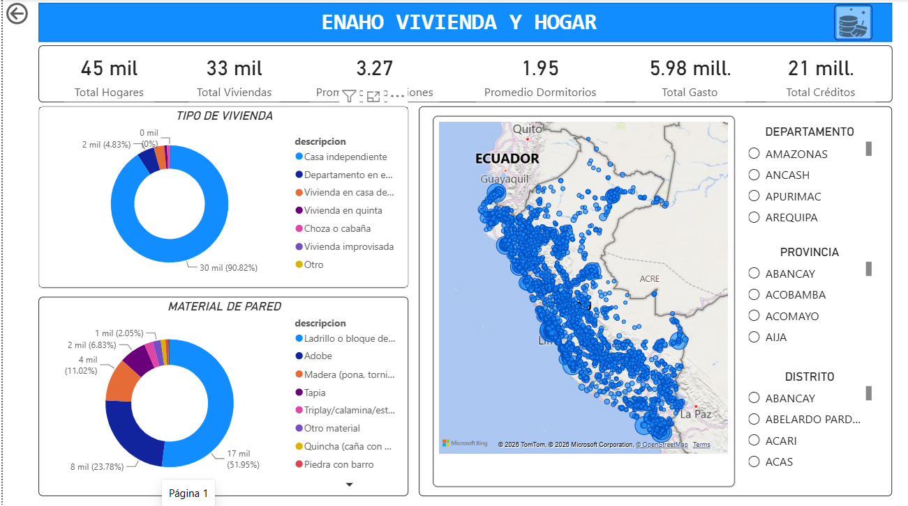
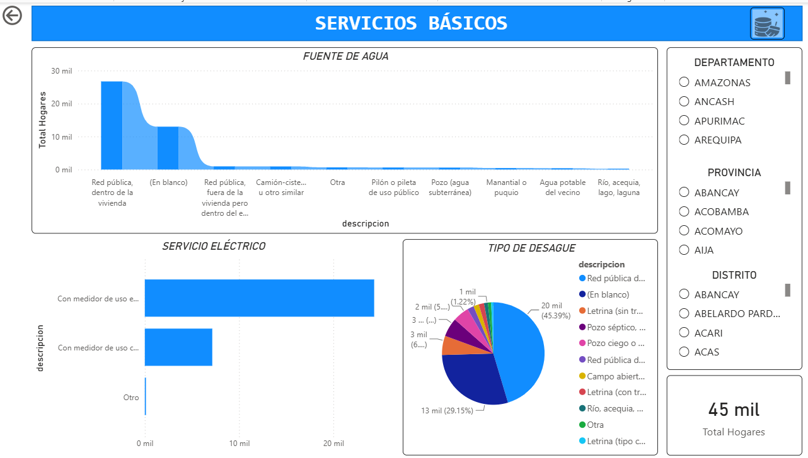

# ENAHO Vivienda y Hogar 2025 — Base de datos normalizada + Dashboard Power BI

Diseño, normalización y explotación en **SQL Server** de la base de datos del módulo **Vivienda y Hogar** de la Encuesta Nacional de Hogares (ENAHO) 2025 del INEI, con un **dashboard interactivo en Power BI** construido sobre esa base ya normalizada.

**Autora:** Sanchez Reyes Claudia Aracely
**Docente:** Dr. Asnate Salazar Edwin Johny
**Universidad Nacional "Santiago Antúnez de Mayolo"** — Escuela Profesional de Estadística e Informática — Huaraz, Perú, 2025

---

## 📋 Descripción del proyecto

La base original de la ENAHO llega como una única tabla plana con variables codificadas (números que representan respuestas). Este proyecto:

1. Carga esa tabla plana en SQL Server (`staging`).
2. Diseña un modelo relacional normalizado hasta la **Tercera Forma Normal (3FN)**, con tablas de catálogo (`CAT_*`) y tablas principales (`TB_*`) relacionadas por llaves primarias y foráneas.
3. Ejecuta un proceso **ETL** que traduce y distribuye los datos crudos hacia ese modelo relacional.
4. Conecta la base normalizada a **Power BI** para construir un dashboard interactivo con indicadores, gráficos, mapa geográfico y segmentadores.

### Objetivo general
Diseñar e implementar una base de datos relacional normalizada del módulo Vivienda y Hogar de la ENAHO mediante SQL Server, con la finalidad de optimizar la organización, integridad y explotación de la información para su análisis en herramientas de inteligencia de negocios.

### Objetivos específicos
- Analizar la estructura original de la base de datos del módulo Vivienda y Hogar de la ENAHO.
- Identificar las entidades, atributos y relaciones necesarias para construir un modelo relacional normalizado.
- Implementar la normalización mediante la creación de tablas relacionadas en SQL Server.
- Descodificar las variables utilizando el diccionario oficial de la ENAHO.
- Elaborar el diagrama entidad-relación (MER) de la estructura final.
- Preparar la base de datos para su explotación mediante Power BI.

---

## 📁 Contenido del repositorio

| Archivo | Tipo | Descripción |
|---|---|---|
| [`SQLQuery1.sql`](./SQLQuery1.sql) | SQL | Crea la base `ENAHO_VIVIENDA_HOGAR`, el esquema `staging` y la tabla `staging.STG_ENAHO01_100`, y carga en ella el CSV original de la ENAHO (`BULK INSERT`). |
| [`SQLQuery2.sql`](./SQLQuery2.sql) | SQL | Crea y llena las tablas de catálogo (`CAT_*`) usadas para descodificar las variables: dominio, estrato, tipo de vivienda, materiales, tenencia, créditos, servicios básicos, TIC, gastos, etc. |
| [`SQLQuery3.sql`](./SQLQuery3.sql) | SQL | Crea y llena `CAT_UBIGEO`, el catálogo maestro de los 1,899 distritos del Perú (departamento, provincia, distrito, región natural). Es un archivo largo (~1,900 líneas de datos); se ejecuta tal cual, sin editar. |
| [`SQLQuery4.sql`](./SQLQuery4.sql) | SQL | Crea el modelo relacional definitivo: `TB_UBICACION`, `TB_HOGAR`, `TB_VIVIENDA`, `TB_TENENCIA`, `TB_CREDITO_VIVIENDA`, `TB_CREDITO_ENTIDAD`, `TB_SERVICIOS_BASICOS`, `TB_HOGAR_ALUMBRADO`, `TB_HOGAR_COMBUSTIBLE`, `TB_CLORO_AGUA`, `TB_HOGAR_SERVICIO_TIC`, `TB_HOGAR_CONEXION_INTERNET`, `TB_GASTO_HOGAR` y `TB_INDICADORES_NBI`. |
| [`05_etl_carga.sql`](./05_etl_carga.sql) | SQL | ETL: lee `staging` y llena todas las tablas del modelo relacional, con limpieza de datos (`TRY_CAST`, `TRIM`, comas → puntos decimales, descarte de "no sabe/no responde"). Incluye consultas de verificación. |
| [`DASHBOARD_FINAL.pbix`](./DASHBOARD_FINAL.pbix) | Power BI | Dashboard interactivo conectado a SQL Server, con las páginas *Panel principal*, *ENAHO Vivienda y Hogar* y *Servicios Básicos*. |
| [`INFORME_ANALISIS_Y_EXPLOTACIÓN_SANCHEZ_REYES.docx`](./INFORME_ANALISIS_Y_EXPLOTACIÓN_SANCHEZ_REYES.docx) | Word | Informe académico completo del proyecto, con capturas de pantalla paso a paso. |
| [`capturas/`](./capturas) | Imágenes | Capturas de pantalla de las 3 páginas del dashboard (Panel principal, Vivienda y Hogar, Servicios Básicos), para verlas sin abrir Power BI. |

---

## ✅ Requisitos previos

- Microsoft SQL Server (2019+) y SQL Server Management Studio (SSMS)
- Microsoft Power BI Desktop
- El CSV original de la ENAHO 2025, módulo 100 (Vivienda y Hogar), descargado del portal de microdatos del INEI
- Permisos para crear bases de datos y ejecutar `BULK INSERT` en la instancia de SQL Server

---

## 🚀 Cómo reconstruir la base de datos, paso a paso

Ejecutar en **SSMS**, en este orden exacto (cada script depende del anterior):

### Paso 1 — Cargar los datos crudos (`SQLQuery1.sql`)

1. Abrir `SQLQuery1.sql`.
2. **Editar la ruta del CSV** en la instrucción `BULK INSERT` antes de ejecutar:
   ```sql
   BULK INSERT staging.STG_ENAHO01_100
   FROM 'C:\SQLDATA\Enaho01-2025-100.csv'   -- 👈 cambiar por tu ruta real
   WITH (
       FIRSTROW = 2,
       FIELDTERMINATOR = ';',
       ROWTERMINATOR = '0x0d0a',
       CODEPAGE = '1252',
       TABLOCK
   );
   ```
3. Ejecutar el script completo. Crea la base `ENAHO_VIVIENDA_HOGAR` y carga ~44,599 hogares en `staging.STG_ENAHO01_100`.
4. Verificar con las consultas finales (`COUNT(*)`, `TOP 5`).

<details>
<summary>📄 Ver script completo — <code>SQLQuery1.sql</code></summary>

```sql
IF DB_ID('ENAHO_VIVIENDA_HOGAR') IS NULL
BEGIN
    CREATE DATABASE ENAHO_VIVIENDA_HOGAR;
END
GO

USE ENAHO_VIVIENDA_HOGAR;
GO

IF NOT EXISTS (SELECT 1 FROM sys.schemas WHERE name = 'staging')
    EXEC('CREATE SCHEMA staging');
GO

IF OBJECT_ID('staging.STG_ENAHO01_100') IS NOT NULL
    DROP TABLE staging.STG_ENAHO01_100;
GO

CREATE TABLE staging.STG_ENAHO01_100 (
    [AÑO] VARCHAR(MAX) NULL,
    [MES] VARCHAR(MAX) NULL,
    [CONGLOME] VARCHAR(MAX) NULL,
    [VIVIENDA] VARCHAR(MAX) NULL,
    [HOGAR] VARCHAR(MAX) NULL,
    [UBIGEO] VARCHAR(MAX) NULL,
    [DOMINIO] VARCHAR(MAX) NULL,
    [ESTRATO] VARCHAR(MAX) NULL,
    [PERIODO] VARCHAR(MAX) NULL,
    [TIPENC] VARCHAR(MAX) NULL,
    [FECENT] VARCHAR(MAX) NULL,
    [RESULT] VARCHAR(MAX) NULL,
    [PANEL] VARCHAR(MAX) NULL,
    [P22] VARCHAR(MAX) NULL,
    [P23] VARCHAR(MAX) NULL,
    [P24A] VARCHAR(MAX) NULL,
    [P24B] VARCHAR(MAX) NULL,
    [P25$1] VARCHAR(MAX) NULL,
    [P25$2] VARCHAR(MAX) NULL,
    [P25$3] VARCHAR(MAX) NULL,
    [P25$4] VARCHAR(MAX) NULL,
    [P25$5] VARCHAR(MAX) NULL,
    [P101] VARCHAR(MAX) NULL,
    [P102] VARCHAR(MAX) NULL,
    [P103] VARCHAR(MAX) NULL,
    [P103A] VARCHAR(MAX) NULL,
    [P104] VARCHAR(MAX) NULL,
    [P104A] VARCHAR(MAX) NULL,
    [P105A] VARCHAR(MAX) NULL,
    [P105B] VARCHAR(MAX) NULL,
    [P106] VARCHAR(MAX) NULL,
    [P106A] VARCHAR(MAX) NULL,
    [P106B] VARCHAR(MAX) NULL,
    [P107B1] VARCHAR(MAX) NULL,
    [P107C11] VARCHAR(MAX) NULL,
    [P107C12] VARCHAR(MAX) NULL,
    [P107C13] VARCHAR(MAX) NULL,
    [P107C14] VARCHAR(MAX) NULL,
    [P107C16] VARCHAR(MAX) NULL,
    [P107C17] VARCHAR(MAX) NULL,
    [P107C18] VARCHAR(MAX) NULL,
    [P107C19] VARCHAR(MAX) NULL,
    [P107C110] VARCHAR(MAX) NULL,
    [P107D1] VARCHAR(MAX) NULL,
    [P107B2] VARCHAR(MAX) NULL,
    [P107C21] VARCHAR(MAX) NULL,
    [P107C22] VARCHAR(MAX) NULL,
    [P107C23] VARCHAR(MAX) NULL,
    [P107C24] VARCHAR(MAX) NULL,
    [P107C26] VARCHAR(MAX) NULL,
    [P107C27] VARCHAR(MAX) NULL,
    [P107C28] VARCHAR(MAX) NULL,
    [P107C29] VARCHAR(MAX) NULL,
    [P107C210] VARCHAR(MAX) NULL,
    [P107D2] VARCHAR(MAX) NULL,
    [P107B3] VARCHAR(MAX) NULL,
    [P107C31] VARCHAR(MAX) NULL,
    [P107C32] VARCHAR(MAX) NULL,
    [P107C33] VARCHAR(MAX) NULL,
    [P107C34] VARCHAR(MAX) NULL,
    [P107C36] VARCHAR(MAX) NULL,
    [P107C37] VARCHAR(MAX) NULL,
    [P107C38] VARCHAR(MAX) NULL,
    [P107C39] VARCHAR(MAX) NULL,
    [P107C310] VARCHAR(MAX) NULL,
    [P107D3] VARCHAR(MAX) NULL,
    [P107B4] VARCHAR(MAX) NULL,
    [P107C41] VARCHAR(MAX) NULL,
    [P107C42] VARCHAR(MAX) NULL,
    [P107C43] VARCHAR(MAX) NULL,
    [P107C44] VARCHAR(MAX) NULL,
    [P107C46] VARCHAR(MAX) NULL,
    [P107C47] VARCHAR(MAX) NULL,
    [P107C48] VARCHAR(MAX) NULL,
    [P107C49] VARCHAR(MAX) NULL,
    [P107C410] VARCHAR(MAX) NULL,
    [P107D4] VARCHAR(MAX) NULL,
    [P110] VARCHAR(MAX) NULL,
    [P110A1] VARCHAR(MAX) NULL,
    [P110A] VARCHAR(MAX) NULL,
    [P110A_MODIFICADA] VARCHAR(MAX) NULL,
    [P110C] VARCHAR(MAX) NULL,
    [P110C1] VARCHAR(MAX) NULL,
    [P110C2] VARCHAR(MAX) NULL,
    [P110C3] VARCHAR(MAX) NULL,
    [P110D] VARCHAR(MAX) NULL,
    [P110E] VARCHAR(MAX) NULL,
    [P111A] VARCHAR(MAX) NULL,
    [P1121] VARCHAR(MAX) NULL,
    [P1123] VARCHAR(MAX) NULL,
    [P1124] VARCHAR(MAX) NULL,
    [P1125] VARCHAR(MAX) NULL,
    [P1126] VARCHAR(MAX) NULL,
    [P1127] VARCHAR(MAX) NULL,
    [P112A] VARCHAR(MAX) NULL,
    [P1131] VARCHAR(MAX) NULL,
    [P1132] VARCHAR(MAX) NULL,
    [P1133] VARCHAR(MAX) NULL,
    [P1135] VARCHAR(MAX) NULL,
    [P1136] VARCHAR(MAX) NULL,
    [P1139] VARCHAR(MAX) NULL,
    [P1137] VARCHAR(MAX) NULL,
    [P1138] VARCHAR(MAX) NULL,
    [P113A] VARCHAR(MAX) NULL,
    [P1141] VARCHAR(MAX) NULL,
    [P1142] VARCHAR(MAX) NULL,
    [P1143] VARCHAR(MAX) NULL,
    [P1144] VARCHAR(MAX) NULL,
    [P1145] VARCHAR(MAX) NULL,
    [P1146] VARCHAR(MAX) NULL,
    [P114B1] VARCHAR(MAX) NULL,
    [P114B2] VARCHAR(MAX) NULL,
    [P114B3] VARCHAR(MAX) NULL,
    [P1171$01] VARCHAR(MAX) NULL,
    [P1171$02] VARCHAR(MAX) NULL,
    [P1171$04] VARCHAR(MAX) NULL,
    [P1171$05] VARCHAR(MAX) NULL,
    [P1171$06] VARCHAR(MAX) NULL,
    [P1171$07] VARCHAR(MAX) NULL,
    [P1171$08] VARCHAR(MAX) NULL,
    [P1171$09] VARCHAR(MAX) NULL,
    [P1171$10] VARCHAR(MAX) NULL,
    [P1171$11] VARCHAR(MAX) NULL,
    [P1171$12] VARCHAR(MAX) NULL,
    [P1171$13] VARCHAR(MAX) NULL,
    [P1171$14] VARCHAR(MAX) NULL,
    [P1171$15] VARCHAR(MAX) NULL,
    [P1171$16] VARCHAR(MAX) NULL,
    [P1171$17] VARCHAR(MAX) NULL,
    [P1172$01] VARCHAR(MAX) NULL,
    [P1172$02] VARCHAR(MAX) NULL,
    [P1172$04] VARCHAR(MAX) NULL,
    [P1172$05] VARCHAR(MAX) NULL,
    [P1172$06] VARCHAR(MAX) NULL,
    [P1172$07] VARCHAR(MAX) NULL,
    [P1172$08] VARCHAR(MAX) NULL,
    [P1172$09] VARCHAR(MAX) NULL,
    [P1172$10] VARCHAR(MAX) NULL,
    [P1172$11] VARCHAR(MAX) NULL,
    [P1172$12] VARCHAR(MAX) NULL,
    [P1172$13] VARCHAR(MAX) NULL,
    [P1172$14] VARCHAR(MAX) NULL,
    [P1172$15] VARCHAR(MAX) NULL,
    [P1172$16] VARCHAR(MAX) NULL,
    [P1172$17] VARCHAR(MAX) NULL,
    [P1173$01] VARCHAR(MAX) NULL,
    [P1173$02] VARCHAR(MAX) NULL,
    [P1173$04] VARCHAR(MAX) NULL,
    [P1173$05] VARCHAR(MAX) NULL,
    [P1173$06] VARCHAR(MAX) NULL,
    [P1173$07] VARCHAR(MAX) NULL,
    [P1173$08] VARCHAR(MAX) NULL,
    [P1173$09] VARCHAR(MAX) NULL,
    [P1173$10] VARCHAR(MAX) NULL,
    [P1173$11] VARCHAR(MAX) NULL,
    [P1173$12] VARCHAR(MAX) NULL,
    [P1173$13] VARCHAR(MAX) NULL,
    [P1173$14] VARCHAR(MAX) NULL,
    [P1173$15] VARCHAR(MAX) NULL,
    [P1173$16] VARCHAR(MAX) NULL,
    [P1173$17] VARCHAR(MAX) NULL,
    [P1174$01] VARCHAR(MAX) NULL,
    [P1174$02] VARCHAR(MAX) NULL,
    [P1174$04] VARCHAR(MAX) NULL,
    [P1174$05] VARCHAR(MAX) NULL,
    [P1174$06] VARCHAR(MAX) NULL,
    [P1174$07] VARCHAR(MAX) NULL,
    [P1174$08] VARCHAR(MAX) NULL,
    [P1174$09] VARCHAR(MAX) NULL,
    [P1174$10] VARCHAR(MAX) NULL,
    [P1174$11] VARCHAR(MAX) NULL,
    [P1174$12] VARCHAR(MAX) NULL,
    [P1174$13] VARCHAR(MAX) NULL,
    [P1174$14] VARCHAR(MAX) NULL,
    [P1174$15] VARCHAR(MAX) NULL,
    [P1174$16] VARCHAR(MAX) NULL,
    [P1174$17] VARCHAR(MAX) NULL,
    [P1175$01] VARCHAR(MAX) NULL,
    [P1175$02] VARCHAR(MAX) NULL,
    [P1175$04] VARCHAR(MAX) NULL,
    [P1175$05] VARCHAR(MAX) NULL,
    [P1175$06] VARCHAR(MAX) NULL,
    [P1175$07] VARCHAR(MAX) NULL,
    [P1175$08] VARCHAR(MAX) NULL,
    [P1175$09] VARCHAR(MAX) NULL,
    [P1175$10] VARCHAR(MAX) NULL,
    [P1175$11] VARCHAR(MAX) NULL,
    [P1175$12] VARCHAR(MAX) NULL,
    [P1175$13] VARCHAR(MAX) NULL,
    [P1175$14] VARCHAR(MAX) NULL,
    [P1175$15] VARCHAR(MAX) NULL,
    [P1175$16] VARCHAR(MAX) NULL,
    [P1175$17] VARCHAR(MAX) NULL,
    [P117T2] VARCHAR(MAX) NULL,
    [P117T3] VARCHAR(MAX) NULL,
    [P117T4] VARCHAR(MAX) NULL,
    [T110] VARCHAR(MAX) NULL,
    [P200I] VARCHAR(MAX) NULL,
    [P600I] VARCHAR(MAX) NULL,
    [P600D1] VARCHAR(MAX) NULL,
    [P600M1] VARCHAR(MAX) NULL,
    [P600A1] VARCHAR(MAX) NULL,
    [P600D2] VARCHAR(MAX) NULL,
    [P600M2] VARCHAR(MAX) NULL,
    [P600A2] VARCHAR(MAX) NULL,
    [P612I1] VARCHAR(MAX) NULL,
    [P612I11] VARCHAR(MAX) NULL,
    [P612I2] VARCHAR(MAX) NULL,
    [P612I22] VARCHAR(MAX) NULL,
    [P700I] VARCHAR(MAX) NULL,
    [P710I] VARCHAR(MAX) NULL,
    [P800I] VARCHAR(MAX) NULL,
    [P110I] VARCHAR(MAX) NULL,
    [TICUEST01] VARCHAR(MAX) NULL,
    [D105B] VARCHAR(MAX) NULL,
    [D106] VARCHAR(MAX) NULL,
    [D107D1] VARCHAR(MAX) NULL,
    [D107D2] VARCHAR(MAX) NULL,
    [D107D3] VARCHAR(MAX) NULL,
    [D107D4] VARCHAR(MAX) NULL,
    [D1172$01] VARCHAR(MAX) NULL,
    [D1173$01] VARCHAR(MAX) NULL,
    [D1174$01] VARCHAR(MAX) NULL,
    [D1172$02] VARCHAR(MAX) NULL,
    [D1173$02] VARCHAR(MAX) NULL,
    [D1174$02] VARCHAR(MAX) NULL,
    [D1172$04] VARCHAR(MAX) NULL,
    [D1173$04] VARCHAR(MAX) NULL,
    [D1174$04] VARCHAR(MAX) NULL,
    [D1172$05] VARCHAR(MAX) NULL,
    [D1173$05] VARCHAR(MAX) NULL,
    [D1174$05] VARCHAR(MAX) NULL,
    [D1172$06] VARCHAR(MAX) NULL,
    [D1173$06] VARCHAR(MAX) NULL,
    [D1174$06] VARCHAR(MAX) NULL,
    [D1172$07] VARCHAR(MAX) NULL,
    [D1173$07] VARCHAR(MAX) NULL,
    [D1174$07] VARCHAR(MAX) NULL,
    [D1172$08] VARCHAR(MAX) NULL,
    [D1173$08] VARCHAR(MAX) NULL,
    [D1174$08] VARCHAR(MAX) NULL,
    [D1172$09] VARCHAR(MAX) NULL,
    [D1173$09] VARCHAR(MAX) NULL,
    [D1174$09] VARCHAR(MAX) NULL,
    [D1172$10] VARCHAR(MAX) NULL,
    [D1173$10] VARCHAR(MAX) NULL,
    [D1174$10] VARCHAR(MAX) NULL,
    [D1172$15] VARCHAR(MAX) NULL,
    [D1173$15] VARCHAR(MAX) NULL,
    [D1174$15] VARCHAR(MAX) NULL,
    [D1172$16] VARCHAR(MAX) NULL,
    [D1173$16] VARCHAR(MAX) NULL,
    [D1174$16] VARCHAR(MAX) NULL,
    [D612I11] VARCHAR(MAX) NULL,
    [D1172$11] VARCHAR(MAX) NULL,
    [D1173$11] VARCHAR(MAX) NULL,
    [D1174$11] VARCHAR(MAX) NULL,
    [D1172$12] VARCHAR(MAX) NULL,
    [D1173$12] VARCHAR(MAX) NULL,
    [D1174$12] VARCHAR(MAX) NULL,
    [D1172$13] VARCHAR(MAX) NULL,
    [D1173$13] VARCHAR(MAX) NULL,
    [D1174$13] VARCHAR(MAX) NULL,
    [D1172$14] VARCHAR(MAX) NULL,
    [D1173$14] VARCHAR(MAX) NULL,
    [D1174$14] VARCHAR(MAX) NULL,
    [D1172$17] VARCHAR(MAX) NULL,
    [D1173$17] VARCHAR(MAX) NULL,
    [D1174$17] VARCHAR(MAX) NULL,
    [D612I22] VARCHAR(MAX) NULL,
    [I105B] VARCHAR(MAX) NULL,
    [I106] VARCHAR(MAX) NULL,
    [I1172$01] VARCHAR(MAX) NULL,
    [I1172$02] VARCHAR(MAX) NULL,
    [I1172$04] VARCHAR(MAX) NULL,
    [I1172$05] VARCHAR(MAX) NULL,
    [I1172$06] VARCHAR(MAX) NULL,
    [I1172$07] VARCHAR(MAX) NULL,
    [I1172$08] VARCHAR(MAX) NULL,
    [I1172$09] VARCHAR(MAX) NULL,
    [I1172$10] VARCHAR(MAX) NULL,
    [I1172$11] VARCHAR(MAX) NULL,
    [I1172$12] VARCHAR(MAX) NULL,
    [I1172$13] VARCHAR(MAX) NULL,
    [I1172$14] VARCHAR(MAX) NULL,
    [I1172$17] VARCHAR(MAX) NULL,
    [I1172$15] VARCHAR(MAX) NULL,
    [I1172$16] VARCHAR(MAX) NULL,
    [I1173$01] VARCHAR(MAX) NULL,
    [I1174$01] VARCHAR(MAX) NULL,
    [I1173$02] VARCHAR(MAX) NULL,
    [I1174$02] VARCHAR(MAX) NULL,
    [I1173$04] VARCHAR(MAX) NULL,
    [I1174$04] VARCHAR(MAX) NULL,
    [I1173$05] VARCHAR(MAX) NULL,
    [I1174$05] VARCHAR(MAX) NULL,
    [I1173$06] VARCHAR(MAX) NULL,
    [I1174$06] VARCHAR(MAX) NULL,
    [I1173$07] VARCHAR(MAX) NULL,
    [I1174$07] VARCHAR(MAX) NULL,
    [I1173$08] VARCHAR(MAX) NULL,
    [I1174$08] VARCHAR(MAX) NULL,
    [I1173$09] VARCHAR(MAX) NULL,
    [I1174$09] VARCHAR(MAX) NULL,
    [I1173$10] VARCHAR(MAX) NULL,
    [I1174$10] VARCHAR(MAX) NULL,
    [I1173$11] VARCHAR(MAX) NULL,
    [I1174$11] VARCHAR(MAX) NULL,
    [I1173$12] VARCHAR(MAX) NULL,
    [I1174$12] VARCHAR(MAX) NULL,
    [I1173$13] VARCHAR(MAX) NULL,
    [I1174$13] VARCHAR(MAX) NULL,
    [I1173$14] VARCHAR(MAX) NULL,
    [I1174$14] VARCHAR(MAX) NULL,
    [I1173$15] VARCHAR(MAX) NULL,
    [I1174$15] VARCHAR(MAX) NULL,
    [I1173$16] VARCHAR(MAX) NULL,
    [I1174$16] VARCHAR(MAX) NULL,
    [I1173$17] VARCHAR(MAX) NULL,
    [I1174$17] VARCHAR(MAX) NULL,
    [T111A] VARCHAR(MAX) NULL,
    [NBI1] VARCHAR(MAX) NULL,
    [NBI2] VARCHAR(MAX) NULL,
    [NBI3] VARCHAR(MAX) NULL,
    [NBI4] VARCHAR(MAX) NULL,
    [NBI5] VARCHAR(MAX) NULL,
    [FACTOR07] VARCHAR(MAX) NULL,
    [CODCCPP] VARCHAR(MAX) NULL,
    [NOMCCPP] VARCHAR(MAX) NULL,
    [NCONGLOME] VARCHAR(MAX) NULL,
    [SUB_CONGLOME] VARCHAR(MAX) NULL,
    [LONGITUD] VARCHAR(MAX) NULL,
    [LATITUD] VARCHAR(MAX) NULL,
    [ALTITUD] VARCHAR(MAX) NULL
);
GO


BULK INSERT staging.STG_ENAHO01_100
FROM 'C:\SQLDATA\Enaho01-2025-100.csv'
WITH (
    FIRSTROW      = 2,              
    FIELDTERMINATOR = ';',
    ROWTERMINATOR   = '0x0d0a',      
    CODEPAGE        = '1252',        
    TABLOCK
);
GO

-- 5. Verificación rápida 
SELECT COUNT(*) AS total_filas FROM staging.STG_ENAHO01_100;
-- Debe devolver 44,599 hogares aproximadamente

SELECT TOP 5 * FROM staging.STG_ENAHO01_100;
GO
```
</details>

### Paso 2 — Crear las tablas de catálogo (`SQLQuery2.sql`)

Ejecutar el script completo. Crea y llena todas las tablas `CAT_*` (dominio, estrato, tipo de vivienda, materiales de pared/piso/techo, tenencia, créditos, servicios básicos, TIC, gastos, etc.), usadas para descodificar las variables numéricas de la encuesta.

<details>
<summary>📄 Ver script completo — <code>SQLQuery2.sql</code></summary>

```sql
USE ENAHO_VIVIENDA_HOGAR;
GO

CREATE TABLE dbo.CAT_DOMINIO (
    id_dominio TINYINT PRIMARY KEY,
    descripcion VARCHAR(MAX) NOT NULL
);
INSERT INTO dbo.CAT_DOMINIO VALUES
(1,'Costa Norte'),(2,'Costa Centro'),(3,'Costa Sur'),(4,'Sierra Norte'),
(5,'Sierra Centro'),(6,'Sierra Sur'),(7,'Selva'),(8,'Lima Metropolitana');

CREATE TABLE dbo.CAT_ESTRATO (
    id_estrato TINYINT PRIMARY KEY,
    descripcion VARCHAR(MAX) NOT NULL
);
INSERT INTO dbo.CAT_ESTRATO VALUES
(1,'De 500 000 a más habitantes'),(2,'De 100 000 a 499 999 habitantes'),
(3,'De 50 000 a 99 999 habitantes'),(4,'De 20 000 a 49 999 habitantes'),
(5,'De 2 000 a 19 999 habitantes'),(6,'De 500 a 1 999 habitantes'),
(7,'Área de Empadronamiento Rural (AER) Compuesto'),
(8,'Área de Empadronamiento Rural (AER) Simple');

CREATE TABLE dbo.CAT_PERIODO (
    id_periodo TINYINT PRIMARY KEY,
    descripcion VARCHAR(MAX) NOT NULL
);
INSERT INTO dbo.CAT_PERIODO VALUES
(1,'Primer Período'),(2,'Segundo Período'),(3,'Tercer Período'),
(4,'Cuarto Período'),(5,'Quinto Período');

CREATE TABLE dbo.CAT_TIPO_SELECCION (
    id_tipo_seleccion TINYINT PRIMARY KEY,
    descripcion VARCHAR(MAX) NOT NULL
);
INSERT INTO dbo.CAT_TIPO_SELECCION VALUES
(1,'Selección Automática por Computadora - Área Urbana'),
(3,'Selección por Muestra Panel'),
(4,'Selección Automática por Computadora - Área Rural'),
(5,'Selección por conteo de la encuestadora en el Área Rural');

CREATE TABLE dbo.CAT_RESULTADO_ENCUESTA (
    id_resultado TINYINT PRIMARY KEY,
    descripcion VARCHAR(MAX) NOT NULL
);
INSERT INTO dbo.CAT_RESULTADO_ENCUESTA VALUES
(1,'Completa'),(2,'Incompleta'),(3,'Rechazo'),(4,'Ausente'),
(5,'Vivienda Desocupada'),(6,'No se Inició la Entrevista'),(7,'Otro');

CREATE TABLE dbo.CAT_ORIGEN_CUESTIONARIO (
    id_origen TINYINT PRIMARY KEY,
    descripcion VARCHAR(MAX) NOT NULL
);
INSERT INTO dbo.CAT_ORIGEN_CUESTIONARIO VALUES
(1,'Cuestionario en hojas'),(2,'Cuestionario en Tablet');

CREATE TABLE dbo.CAT_SI_NO (
    id_si_no TINYINT PRIMARY KEY,
    descripcion VARCHAR(MAX) NOT NULL
);
INSERT INTO dbo.CAT_SI_NO VALUES (1,'Sí'),(2,'No');

CREATE TABLE dbo.CAT_TIPO_VIVIENDA (
    id_tipo_vivienda TINYINT PRIMARY KEY,
    descripcion VARCHAR(MAX) NOT NULL
);
INSERT INTO dbo.CAT_TIPO_VIVIENDA VALUES
(1,'Casa independiente'),(2,'Departamento en edificio'),(3,'Vivienda en quinta'),
(4,'Vivienda en casa de vecindad (callejón, solar o corralón)'),
(5,'Choza o cabaña'),(6,'Vivienda improvisada'),
(7,'Local no destinado para habitación humana'),(8,'Otro');

CREATE TABLE dbo.CAT_MATERIAL_PARED (
    id_material_pared TINYINT PRIMARY KEY,
    descripcion VARCHAR(MAX) NOT NULL
);
INSERT INTO dbo.CAT_MATERIAL_PARED VALUES
(1,'Ladrillo o bloque de cemento'),(2,'Piedra o sillar con cal o cemento'),
(3,'Adobe'),(4,'Tapia'),(5,'Quincha (caña con barro)'),(6,'Piedra con barro'),
(7,'Madera (pona, tornillo, etc.)'),(8,'Triplay/calamina/estera'),(9,'Otro material');

CREATE TABLE dbo.CAT_MATERIAL_PISO (
    id_material_piso TINYINT PRIMARY KEY,
    descripcion VARCHAR(MAX) NOT NULL
);
INSERT INTO dbo.CAT_MATERIAL_PISO VALUES
(1,'Parquet o madera pulida'),(2,'Láminas asfálticas, vinílicos o similares'),
(3,'Losetas, terrazos o similares'),(4,'Madera (pona, tornillo, etc.)'),
(5,'Cemento'),(6,'Tierra'),(7,'Otro material');

CREATE TABLE dbo.CAT_MATERIAL_TECHO (
    id_material_techo TINYINT PRIMARY KEY,
    descripcion VARCHAR(MAX) NOT NULL
);
INSERT INTO dbo.CAT_MATERIAL_TECHO VALUES
(1,'Concreto armado'),(2,'Madera'),(3,'Tejas'),
(4,'Planchas de calamina, fibra de cemento o similares'),
(5,'Caña o estera con torta de barro o cemento'),(6,'Triplay/estera/carrizo'),
(7,'Paja, hojas de palmera'),(8,'Otro material');

CREATE TABLE dbo.CAT_FACHADA_TARRAJEO (
    id_fachada_tarrajeo TINYINT PRIMARY KEY,
    descripcion VARCHAR(MAX) NOT NULL
);
INSERT INTO dbo.CAT_FACHADA_TARRAJEO VALUES
(1,'Total'),(2,'Parcial'),(3,'No está tarrajeada'),(4,'No corresponde');

CREATE TABLE dbo.CAT_FACHADA_PINTADA (
    id_fachada_pintada TINYINT PRIMARY KEY,
    descripcion VARCHAR(MAX) NOT NULL
);
INSERT INTO dbo.CAT_FACHADA_PINTADA VALUES
(1,'Totalmente'),(2,'Parcialmente'),(3,'Sin pintar');

-- Tenencia y crédito ----------------------------------------------------------
CREATE TABLE dbo.CAT_TENENCIA_VIVIENDA (
    id_tenencia TINYINT PRIMARY KEY,
    descripcion VARCHAR(MAX) NOT NULL
);
INSERT INTO dbo.CAT_TENENCIA_VIVIENDA VALUES
(1,'Alquilada'),(2,'Propia, totalmente pagada'),(3,'Propia, por invasión'),
(4,'Propia, comprándola a plazos'),(5,'Cedida por el centro de trabajo'),
(6,'Cedida por otro hogar o institución'),(7,'Otra forma');

CREATE TABLE dbo.CAT_TITULO_PROPIEDAD (
    id_titulo TINYINT PRIMARY KEY,
    descripcion VARCHAR(MAX) NOT NULL
);
INSERT INTO dbo.CAT_TITULO_PROPIEDAD VALUES
(1,'Sí'),(2,'No'),(3,'En trámite de titulación');

CREATE TABLE dbo.CAT_TIPO_CREDITO (
    id_tipo_credito TINYINT PRIMARY KEY,
    descripcion VARCHAR(MAX) NOT NULL
);
INSERT INTO dbo.CAT_TIPO_CREDITO VALUES
(1,'Comprar casa o departamento'),(2,'Comprar terreno para vivienda'),
(3,'Mejoramiento y/o ampliación de la vivienda'),(4,'Construcción de vivienda nueva');

CREATE TABLE dbo.CAT_ENTIDAD_CREDITO (
    id_entidad TINYINT PRIMARY KEY,
    descripcion VARCHAR(MAX) NOT NULL
);
INSERT INTO dbo.CAT_ENTIDAD_CREDITO VALUES
(1,'Banco privado'),(2,'Banco de la Nación'),(3,'Caja Municipal'),
(4,'Persona particular'),(6,'Techo propio'),(7,'Financiera de Ahorro y Crédito'),
(8,'Otro'),(9,'Cooperativa de Ahorro y Crédito'),(10,'Derrama Magisterial');

-- Servicios básicos -------------------------------------------------------------
CREATE TABLE dbo.CAT_FUENTE_AGUA (
    id_fuente_agua TINYINT PRIMARY KEY,
    descripcion VARCHAR(MAX) NOT NULL
);
INSERT INTO dbo.CAT_FUENTE_AGUA VALUES
(1,'Red pública, dentro de la vivienda'),
(2,'Red pública, fuera de la vivienda pero dentro del edificio'),
(3,'Pilón o pileta de uso público'),(4,'Camión-cisterna u otro similar'),
(5,'Pozo (agua subterránea)'),(6,'Manantial o puquio'),(7,'Otra'),
(8,'Río, acequia, lago, laguna'),(9,'Agua potable del vecino');

CREATE TABLE dbo.CAT_NIVEL_CLORO (
    id_nivel_cloro TINYINT PRIMARY KEY,
    descripcion VARCHAR(MAX) NOT NULL
);
INSERT INTO dbo.CAT_NIVEL_CLORO VALUES
(1,'Seguro (Mayor o igual a 0.5 mg/Lt)'),
(2,'Inadecuada dosificación de Cloro (0.1 a menos de 0.5 mg/Lt)'),
(3,'Sin Cloro (0.0 mg/Lt)');

CREATE TABLE dbo.CAT_EXTRACCION_POR (
    id_extraccion_por TINYINT PRIMARY KEY,
    descripcion VARCHAR(MAX) NOT NULL
);
INSERT INTO dbo.CAT_EXTRACCION_POR VALUES
(1,'El funcionario de la encuesta'),(2,'El informante');

CREATE TABLE dbo.CAT_EXTRACCION_DE (
    id_extraccion_de TINYINT PRIMARY KEY,
    descripcion VARCHAR(MAX) NOT NULL
);
INSERT INTO dbo.CAT_EXTRACCION_DE VALUES
(1,'Grifo o caño'),(2,'Cilindro de metal'),(3,'Balde o batea de plástico'),
(4,'Tanque (sin filtro)'),(5,'Tanque (con filtro)'),(6,'Bidón, botella, etc.'),(7,'Otro');

CREATE TABLE dbo.CAT_TIPO_DESAGUE (
    id_tipo_desague TINYINT PRIMARY KEY,
    descripcion VARCHAR(MAX) NOT NULL
);
INSERT INTO dbo.CAT_TIPO_DESAGUE VALUES
(1,'Red pública de desagüe dentro de la vivienda'),
(2,'Red pública de desagüe fuera de la vivienda pero dentro del edificio'),
(3,'Letrina (con tratamiento)'),(4,'Pozo séptico, tanque séptico o biodigestor'),
(5,'Pozo ciego o negro'),(6,'Río, acequia, canal o similar'),(7,'Otra'),
(9,'Campo abierto o al aire libre'),(10,'Letrina (sin tratamiento)'),
(11,'Letrina (tipo compostera)');

CREATE TABLE dbo.CAT_TIPO_ALUMBRADO (
    id_tipo_alumbrado TINYINT PRIMARY KEY,
    descripcion VARCHAR(MAX) NOT NULL
);
INSERT INTO dbo.CAT_TIPO_ALUMBRADO VALUES
(1,'Electricidad'),(3,'Petróleo/gas (lámpara)'),(4,'Vela'),(5,'Generador'),
(6,'Otro'),(7,'No utiliza alumbrado');

CREATE TABLE dbo.CAT_SERVICIO_ELECTRICO (
    id_servicio_electrico TINYINT PRIMARY KEY,
    descripcion VARCHAR(MAX) NOT NULL
);
INSERT INTO dbo.CAT_SERVICIO_ELECTRICO VALUES
(1,'Con medidor de uso exclusivo para la vivienda'),
(2,'Con medidor de uso colectivo (para varias viviendas)'),(3,'Otro');

CREATE TABLE dbo.CAT_COMBUSTIBLE_COCINA (
    id_combustible TINYINT PRIMARY KEY,
    descripcion VARCHAR(MAX) NOT NULL
);
INSERT INTO dbo.CAT_COMBUSTIBLE_COCINA VALUES
(1,'Electricidad'),(2,'Gas (balón GLP)'),(3,'Gas natural (sistema de tuberías)'),
(5,'Carbón'),(6,'Leña'),(7,'Otro (residuos agrícolas, etc.)'),
(8,'No cocinan'),(9,'Bosta, estiércol');

-- Telecomunicaciones ------------------------------------------------------------
CREATE TABLE dbo.CAT_SERVICIO_TIC (
    id_servicio_tic TINYINT PRIMARY KEY,
    descripcion VARCHAR(MAX) NOT NULL
);
INSERT INTO dbo.CAT_SERVICIO_TIC VALUES
(1,'Teléfono (fijo)'),(2,'Teléfono Celular'),(3,'Conexión a TV por cable o satelital'),
(4,'Conexión a Internet (fijo/móvil)'),(5,'No tiene'),(6,'Televisión Digital Terrestre');

CREATE TABLE dbo.CAT_CONEXION_INTERNET (
    id_conexion_internet TINYINT PRIMARY KEY,
    descripcion VARCHAR(MAX) NOT NULL
);
INSERT INTO dbo.CAT_CONEXION_INTERNET VALUES
(1,'Conexión fija'),(2,'Conexión móvil post pago/control'),(3,'Conexión móvil prepago');

-- Gastos del hogar ----------------------------------------------------------------
CREATE TABLE dbo.CAT_TIPO_GASTO (
    id_tipo_gasto VARCHAR(2) PRIMARY KEY,  
    descripcion VARCHAR(MAX) NOT NULL
);
INSERT INTO dbo.CAT_TIPO_GASTO VALUES
('01','Agua'),('02','Electricidad'),('04','Gas (balón GLP)'),
('05','Gas Natural (sistema de tuberías)'),('06','Vela'),('07','Carbón'),
('08','Leña'),('09','Petróleo'),('10','Gasolina'),('11','Teléfono fijo'),
('12','Celular'),('13','TV cable o satelital'),('14','Internet'),
('15','Otro'),('16','Bosta, estiércol'),('17','Internet (portátil)');

CREATE TABLE dbo.CAT_SITUACION_GASTO (
    id_situacion TINYINT PRIMARY KEY,
    descripcion VARCHAR(MAX) NOT NULL
);
INSERT INTO dbo.CAT_SITUACION_GASTO VALUES
(0,'No aplica / Pase'),(1,'Incluido en el alquiler'),(2,'No gastó'),
(3,'No sabe/No responde'),(4,'Incluido en el celular');
GO
```
</details>

### Paso 3 — Cargar la tabla maestra de ubigeos (`SQLQuery3.sql`)

Ejecutar [`SQLQuery3.sql`](./SQLQuery3.sql) sin modificarlo. Crea `dbo.CAT_UBIGEO` con departamento, provincia, distrito, capital legal y región natural para cada ubigeo del Perú (1,899 registros) — es la tabla que permite ubicar geográficamente cada vivienda en el mapa del dashboard.

> Por su extensión (~1,900 líneas, casi todas de datos), este script no se reproduce aquí; ábrelo directamente desde el repositorio con el enlace de arriba.

### Paso 4 — Crear el modelo relacional (`SQLQuery4.sql`)

Ejecutar el script completo. Crea las tablas principales normalizadas y sus llaves primarias/foráneas hacia las tablas de catálogo de los pasos 2 y 3, más los índices de apoyo.

<details>
<summary>📄 Ver script completo — <code>SQLQuery4.sql</code></summary>

```sql
USE ENAHO_VIVIENDA_HOGAR;
GO

--UBICACIÓN 

CREATE TABLE dbo.TB_UBICACION (
    id_ubicacion   INT IDENTITY(1,1) PRIMARY KEY,
    ubigeo         CHAR(6)      NOT NULL REFERENCES dbo.CAT_UBIGEO(ubigeo),
    id_dominio     TINYINT      NULL REFERENCES dbo.CAT_DOMINIO(id_dominio),
    id_estrato     TINYINT      NULL REFERENCES dbo.CAT_ESTRATO(id_estrato),
    codccpp        VARCHAR(4)   NULL,       
    nomccpp        VARCHAR(80)  NULL,       
    longitud       DECIMAL(9,2) NULL,
    latitud        DECIMAL(9,2) NULL,
    CONSTRAINT UQ_UBICACION UNIQUE (ubigeo, codccpp)
);
GO

--HOGAR 
CREATE TABLE dbo.TB_HOGAR (
    id_hogar        BIGINT IDENTITY(1,1) PRIMARY KEY,
    anio            SMALLINT     NOT NULL,
    mes             TINYINT      NOT NULL,
    conglome        VARCHAR(6)   NOT NULL,
    vivienda        VARCHAR(3)   NOT NULL,
    hogar           VARCHAR(2)   NOT NULL,
    id_ubicacion    INT          NULL REFERENCES dbo.TB_UBICACION(id_ubicacion),
    id_periodo      TINYINT      NULL REFERENCES dbo.CAT_PERIODO(id_periodo),
    id_tipo_seleccion TINYINT    NULL REFERENCES dbo.CAT_TIPO_SELECCION(id_tipo_seleccion),
    fecha_entrevista DATE        NULL,
    id_resultado    TINYINT      NULL REFERENCES dbo.CAT_RESULTADO_ENCUESTA(id_resultado),
    id_panel        TINYINT      NULL REFERENCES dbo.CAT_SI_NO(id_si_no),
    id_origen_cuestionario TINYINT NULL REFERENCES dbo.CAT_ORIGEN_CUESTIONARIO(id_origen),
    factor_expansion DECIMAL(9,2) NULL,
    CONSTRAINT UQ_HOGAR UNIQUE (anio, conglome, vivienda, hogar)
);
GO

--VIVIENDA
CREATE TABLE dbo.TB_VIVIENDA (
    id_hogar            BIGINT PRIMARY KEY REFERENCES dbo.TB_HOGAR(id_hogar),
    id_tipo_vivienda     TINYINT REFERENCES dbo.CAT_TIPO_VIVIENDA(id_tipo_vivienda),
    id_material_pared    TINYINT REFERENCES dbo.CAT_MATERIAL_PARED(id_material_pared),
    id_material_piso     TINYINT REFERENCES dbo.CAT_MATERIAL_PISO(id_material_piso),
    id_material_techo    TINYINT REFERENCES dbo.CAT_MATERIAL_TECHO(id_material_techo),
    id_fachada_tarrajeo  TINYINT REFERENCES dbo.CAT_FACHADA_TARRAJEO(id_fachada_tarrajeo),
    id_fachada_pintada   TINYINT REFERENCES dbo.CAT_FACHADA_PINTADA(id_fachada_pintada),
    calle_pista_asfaltada BIT NULL,
    calle_pista_afirmada  BIT NULL,
    calle_veredas         BIT NULL,
    calle_poste_alumbrado BIT NULL,
    calle_sin_elementos   BIT NULL,
    num_habitaciones      TINYINT NULL,
    num_habitaciones_dormir TINYINT NULL,
    existe_otra_vivienda_id TINYINT NULL REFERENCES dbo.CAT_SI_NO(id_si_no)
);
GO

--TENENCIA
CREATE TABLE dbo.TB_TENENCIA (
    id_hogar               BIGINT PRIMARY KEY REFERENCES dbo.TB_HOGAR(id_hogar),
    id_tenencia            TINYINT REFERENCES dbo.CAT_TENENCIA_VIVIENDA(id_tenencia),
    monto_alquiler_compra  DECIMAL(10,2) NULL,   
    monto_alquiler_estimado DECIMAL(10,2) NULL,  
    id_titulo_propiedad    TINYINT REFERENCES dbo.CAT_TITULO_PROPIEDAD(id_titulo),
    id_titulo_sunarp       TINYINT REFERENCES dbo.CAT_SI_NO(id_si_no)
);
GO

--CRÉDITOS PARA VIVIENDA  
CREATE TABLE dbo.TB_CREDITO_VIVIENDA (
    id_credito       BIGINT IDENTITY(1,1) PRIMARY KEY,
    id_hogar         BIGINT NOT NULL REFERENCES dbo.TB_HOGAR(id_hogar),
    id_tipo_credito  TINYINT NOT NULL REFERENCES dbo.CAT_TIPO_CREDITO(id_tipo_credito),
    obtuvo_credito_id TINYINT NULL REFERENCES dbo.CAT_SI_NO(id_si_no),
    monto_total_credito DECIMAL(10,2) NULL,
    CONSTRAINT UQ_CREDITO_HOGAR UNIQUE (id_hogar, id_tipo_credito)
);
GO

--Entidad
CREATE TABLE dbo.TB_CREDITO_ENTIDAD (
    id_credito BIGINT NOT NULL REFERENCES dbo.TB_CREDITO_VIVIENDA(id_credito),
    id_entidad TINYINT NOT NULL REFERENCES dbo.CAT_ENTIDAD_CREDITO(id_entidad),
    PRIMARY KEY (id_credito, id_entidad)
);
GO

--SERVICIOS BÁSICOS
CREATE TABLE dbo.TB_SERVICIOS_BASICOS (
    id_hogar             BIGINT PRIMARY KEY REFERENCES dbo.TB_HOGAR(id_hogar),
    id_fuente_agua       TINYINT REFERENCES dbo.CAT_FUENTE_AGUA(id_fuente_agua),
    agua_potable_id      TINYINT NULL REFERENCES dbo.CAT_SI_NO(id_si_no),
    agua_servicio_diario_id TINYINT NULL REFERENCES dbo.CAT_SI_NO(id_si_no),
    agua_horas_dia       TINYINT NULL,
    agua_dias_semana     TINYINT NULL,
    id_tipo_desague      TINYINT REFERENCES dbo.CAT_TIPO_DESAGUE(id_tipo_desague),
    id_servicio_electrico TINYINT REFERENCES dbo.CAT_SERVICIO_ELECTRICO(id_servicio_electrico)
);
GO


--Tipos de alumbrado del hogar
CREATE TABLE dbo.TB_HOGAR_ALUMBRADO (
    id_hogar          BIGINT NOT NULL REFERENCES dbo.TB_HOGAR(id_hogar),
    id_tipo_alumbrado TINYINT NOT NULL REFERENCES dbo.CAT_TIPO_ALUMBRADO(id_tipo_alumbrado),
    PRIMARY KEY (id_hogar, id_tipo_alumbrado)
);
GO

--Combustible(s) usados para cocinar
CREATE TABLE dbo.TB_HOGAR_COMBUSTIBLE (
    id_hogar        BIGINT NOT NULL REFERENCES dbo.TB_HOGAR(id_hogar),
    id_combustible  TINYINT NOT NULL REFERENCES dbo.CAT_COMBUSTIBLE_COCINA(id_combustible),
    PRIMARY KEY (id_hogar, id_combustible)
);
GO

--CALIDAD DEL AGUA / CLORO RESIDUAL
CREATE TABLE dbo.TB_CLORO_AGUA (
    id_hogar            BIGINT PRIMARY KEY REFERENCES dbo.TB_HOGAR(id_hogar),
    id_nivel_cloro      TINYINT REFERENCES dbo.CAT_NIVEL_CLORO(id_nivel_cloro),
    lectura_disco       DECIMAL(3,1) NULL,      -- ej. 0.3 mg/Lt (entero.decimal)
    id_extraccion_por   TINYINT REFERENCES dbo.CAT_EXTRACCION_POR(id_extraccion_por),
    id_extraccion_de    TINYINT REFERENCES dbo.CAT_EXTRACCION_DE(id_extraccion_de)
);
GO

--SERVICIOS TIC del hogar 
CREATE TABLE dbo.TB_HOGAR_SERVICIO_TIC (
    id_hogar        BIGINT NOT NULL REFERENCES dbo.TB_HOGAR(id_hogar),
    id_servicio_tic TINYINT NOT NULL REFERENCES dbo.CAT_SERVICIO_TIC(id_servicio_tic),
    PRIMARY KEY (id_hogar, id_servicio_tic)
);
GO

--Tipo de conexión a internet
CREATE TABLE dbo.TB_HOGAR_CONEXION_INTERNET (
    id_hogar              BIGINT NOT NULL REFERENCES dbo.TB_HOGAR(id_hogar),
    id_conexion_internet  TINYINT NOT NULL REFERENCES dbo.CAT_CONEXION_INTERNET(id_conexion_internet),
    PRIMARY KEY (id_hogar, id_conexion_internet)
);
GO

--GASTOS DEL HOGAR 
CREATE TABLE dbo.TB_GASTO_HOGAR (
    id_gasto              BIGINT IDENTITY(1,1) PRIMARY KEY,
    id_hogar              BIGINT NOT NULL REFERENCES dbo.TB_HOGAR(id_hogar),
    id_tipo_gasto         VARCHAR(2) NOT NULL REFERENCES dbo.CAT_TIPO_GASTO(id_tipo_gasto),
    monto_pagado_hogar    DECIMAL(10,2) NULL,   
    monto_donado_otro_hogar DECIMAL(10,2) NULL, 
    monto_autoconsumo     DECIMAL(10,2) NULL,   
    id_situacion_gasto     TINYINT NULL REFERENCES dbo.CAT_SITUACION_GASTO(id_situacion),
    CONSTRAINT UQ_GASTO_HOGAR UNIQUE (id_hogar, id_tipo_gasto)
);
GO

--INDICADORES NBI
CREATE TABLE dbo.TB_INDICADORES_NBI (
    id_hogar                    BIGINT PRIMARY KEY REFERENCES dbo.TB_HOGAR(id_hogar),
    nbi1_vivienda_inadecuada    BIT NULL,
    nbi2_hacinamiento           BIT NULL,
    nbi3_sin_servicios_higienicos BIT NULL,
    nbi4_ninos_no_escuela       BIT NULL,
    nbi5_alta_dependencia       BIT NULL
);
GO

-- Índices de apoyo para las consultas de análisis más comunes
CREATE INDEX IX_HOGAR_UBICACION ON dbo.TB_HOGAR(id_ubicacion);
CREATE INDEX IX_GASTO_TIPO ON dbo.TB_GASTO_HOGAR(id_tipo_gasto);
CREATE INDEX IX_CREDITO_HOGAR ON dbo.TB_CREDITO_VIVIENDA(id_hogar);
GO
```
</details>

### Paso 5 — Ejecutar el ETL de carga (`05_etl_carga.sql`)

Ejecutar el script completo. Lee `staging.STG_ENAHO01_100`, crea la vista de apoyo `dbo.VW_STG_HOGAR_MAP` y distribuye la información en todas las tablas del modelo relacional, con limpieza de tipos (`TRY_CAST`, `TRY_CONVERT`), recorte de espacios y conversión de comas a puntos decimales. Al final incluye consultas de verificación (conteo por tabla + ejemplo de hogar ya descodificado).

<details>
<summary>📄 Ver script completo — <code>05_etl_carga.sql</code></summary>

```sql
USE ENAHO_VIVIENDA_HOGAR;
GO

--TB_UBICACION

;WITH ubic_unica AS (
    SELECT
        s.UBIGEO,
        TRY_CAST(LTRIM(RTRIM(s.DOMINIO)) AS TINYINT) AS DOMINIO,
        TRY_CAST(LTRIM(RTRIM(s.ESTRATO)) AS TINYINT) AS ESTRATO,
        NULLIF(s.CODCCPP,'') AS CODCCPP,
        NULLIF(s.NOMCCPP,'') AS NOMCCPP,
        TRY_CAST(REPLACE(LTRIM(RTRIM(s.LONGITUD)), ',', '.') AS DECIMAL(11,7)) AS LONGITUD,
        TRY_CAST(REPLACE(LTRIM(RTRIM(s.LATITUD)), ',', '.') AS DECIMAL(11,7)) AS LATITUD,
        ROW_NUMBER() OVER (
            PARTITION BY s.UBIGEO, ISNULL(NULLIF(s.CODCCPP,''),'')
            ORDER BY s.CONGLOME
        ) AS rn
    FROM staging.STG_ENAHO01_100 s
)
INSERT INTO dbo.TB_UBICACION (ubigeo, id_dominio, id_estrato, codccpp, nomccpp, longitud, latitud)
SELECT UBIGEO, DOMINIO, ESTRATO, CODCCPP, NOMCCPP, LONGITUD, LATITUD
FROM ubic_unica
WHERE rn = 1;
GO

--TB_HOGAR
INSERT INTO dbo.TB_HOGAR (
    anio, mes, conglome, vivienda, hogar, id_ubicacion, id_periodo,
    id_tipo_seleccion, fecha_entrevista, id_resultado, id_panel,
    id_origen_cuestionario, factor_expansion
)
SELECT
    TRY_CAST(LTRIM(RTRIM(s.[AÑO])) AS SMALLINT),
    TRY_CAST(LTRIM(RTRIM(s.MES)) AS TINYINT),
    s.CONGLOME, s.VIVIENDA, s.HOGAR,
    u.id_ubicacion,
    TRY_CAST(LTRIM(RTRIM(s.PERIODO)) AS TINYINT),
    TRY_CAST(LTRIM(RTRIM(s.TIPENC)) AS TINYINT),
    TRY_CONVERT(DATE, LTRIM(RTRIM(s.FECENT)), 112),       
    TRY_CAST(LTRIM(RTRIM(s.RESULT)) AS TINYINT),
    CASE WHEN TRY_CAST(LTRIM(RTRIM(s.PANEL)) AS TINYINT) IN (1,2)
         THEN TRY_CAST(LTRIM(RTRIM(s.PANEL)) AS TINYINT) ELSE NULL END,
    TRY_CAST(LTRIM(RTRIM(s.TICUEST01)) AS TINYINT),
    TRY_CAST(REPLACE(LTRIM(RTRIM(s.FACTOR07)), ',', '.') AS DECIMAL(12,4)) 
FROM staging.STG_ENAHO01_100 s
LEFT JOIN dbo.TB_UBICACION u
    ON u.ubigeo = s.UBIGEO AND ISNULL(u.codccpp,'') = ISNULL(NULLIF(s.CODCCPP,''),'');
GO

-- Vista de apoyo: relaciona cada fila de staging con su id_hogar ya generado ----
IF OBJECT_ID('dbo.VW_STG_HOGAR_MAP') IS NOT NULL DROP VIEW dbo.VW_STG_HOGAR_MAP;
GO
CREATE VIEW dbo.VW_STG_HOGAR_MAP AS
SELECT h.id_hogar, s.*
FROM staging.STG_ENAHO01_100 s
JOIN dbo.TB_HOGAR h
  ON h.anio = TRY_CAST(LTRIM(RTRIM(s.[AÑO])) AS SMALLINT)
 AND h.conglome = s.CONGLOME AND h.vivienda = s.VIVIENDA AND h.hogar = s.HOGAR;
GO

--TB_VIVIENDA 
INSERT INTO dbo.TB_VIVIENDA
(
    id_hogar,
    id_tipo_vivienda,
    id_material_pared,
    id_material_piso,
    id_material_techo,
    id_fachada_tarrajeo,
    id_fachada_pintada,
    calle_pista_asfaltada,
    calle_pista_afirmada,
    calle_veredas,
    calle_poste_alumbrado,
    calle_sin_elementos,
    num_habitaciones,
    num_habitaciones_dormir,
    existe_otra_vivienda_id
)
SELECT
    m.id_hogar,

    tv.id_tipo_vivienda,
    mp.id_material_pared,
    mpi.id_material_piso,
    mt.id_material_techo,

    NULLIF(TRY_CAST(m.P24A AS TINYINT),9),
    NULLIF(TRY_CAST(m.P24B AS TINYINT),9),

    CASE WHEN m.[P25$1]='1' THEN 1 ELSE 0 END,
    CASE WHEN m.[P25$2]='1' THEN 1 ELSE 0 END,
    CASE WHEN m.[P25$3]='1' THEN 1 ELSE 0 END,
    CASE WHEN m.[P25$4]='1' THEN 1 ELSE 0 END,
    CASE WHEN m.[P25$5]='1' THEN 1 ELSE 0 END,

    NULLIF(TRY_CAST(m.P104 AS TINYINT),99),
    NULLIF(TRY_CAST(m.P104A AS TINYINT),99),

    TRY_CAST(m.P22 AS TINYINT)

FROM dbo.VW_STG_HOGAR_MAP m

LEFT JOIN dbo.CAT_TIPO_VIVIENDA tv
       ON tv.id_tipo_vivienda=TRY_CAST(m.P101 AS TINYINT)

LEFT JOIN dbo.CAT_MATERIAL_PARED mp
       ON mp.id_material_pared=TRY_CAST(m.P102 AS TINYINT)

LEFT JOIN dbo.CAT_MATERIAL_PISO mpi
       ON mpi.id_material_piso=TRY_CAST(m.P103 AS TINYINT)

LEFT JOIN dbo.CAT_MATERIAL_TECHO mt
       ON mt.id_material_techo=TRY_CAST(m.P103A AS TINYINT)

WHERE tv.id_tipo_vivienda IS NOT NULL
  AND mp.id_material_pared IS NOT NULL
  AND mpi.id_material_piso IS NOT NULL
  AND mt.id_material_techo IS NOT NULL;
GO

--TB_TENENCIA 
INSERT INTO dbo.TB_TENENCIA
(
    id_hogar,
    id_tenencia,
    monto_alquiler_compra,
    monto_alquiler_estimado,
    id_titulo_propiedad,
    id_titulo_sunarp
)
SELECT
    m.id_hogar,

    CASE
        WHEN TRY_CAST(m.P105A AS TINYINT) BETWEEN 1 AND 8
        THEN TRY_CAST(m.P105A AS TINYINT)
        ELSE NULL
    END,

    NULLIF(TRY_CAST(m.P105B AS DECIMAL(10,2)),99999),

    NULLIF(TRY_CAST(m.P106 AS DECIMAL(10,2)),99999),

    CASE
        WHEN TRY_CAST(m.P106A AS TINYINT) IN (1,2)
        THEN TRY_CAST(m.P106A AS TINYINT)
        ELSE NULL
    END,

    CASE
        WHEN TRY_CAST(m.P106B AS TINYINT) IN (1,2)
        THEN TRY_CAST(m.P106B AS TINYINT)
        ELSE NULL
    END

FROM dbo.VW_STG_HOGAR_MAP m;
GO
--TB_CREDITO_VIVIENDA
INSERT INTO dbo.TB_CREDITO_VIVIENDA (id_hogar, id_tipo_credito, obtuvo_credito_id, monto_total_credito)
SELECT m.id_hogar, 1, TRY_CAST(LTRIM(RTRIM(m.P107B1)) AS TINYINT), NULLIF(TRY_CAST(LTRIM(RTRIM(m.P107D1)) AS DECIMAL(10,2)),999999)
FROM dbo.VW_STG_HOGAR_MAP m WHERE m.P107B1 IS NOT NULL AND m.P107B1 <> ''
UNION ALL
SELECT m.id_hogar, 2, TRY_CAST(LTRIM(RTRIM(m.P107B2)) AS TINYINT), NULLIF(TRY_CAST(LTRIM(RTRIM(m.P107D2)) AS DECIMAL(10,2)),999999)
FROM dbo.VW_STG_HOGAR_MAP m WHERE m.P107B2 IS NOT NULL AND m.P107B2 <> ''
UNION ALL
SELECT m.id_hogar, 3, TRY_CAST(LTRIM(RTRIM(m.P107B3)) AS TINYINT), NULLIF(TRY_CAST(LTRIM(RTRIM(m.P107D3)) AS DECIMAL(10,2)),999999)
FROM dbo.VW_STG_HOGAR_MAP m WHERE m.P107B3 IS NOT NULL AND m.P107B3 <> ''
UNION ALL
SELECT m.id_hogar, 4, TRY_CAST(LTRIM(RTRIM(m.P107B4)) AS TINYINT), NULLIF(TRY_CAST(LTRIM(RTRIM(m.P107D4)) AS DECIMAL(10,2)),999999)
FROM dbo.VW_STG_HOGAR_MAP m WHERE m.P107B4 IS NOT NULL AND m.P107B4 <> '';
GO

--TB_CREDITO_ENTIDAD 
INSERT INTO dbo.TB_CREDITO_ENTIDAD (id_credito, id_entidad)
SELECT c.id_credito, v.id_entidad
FROM dbo.TB_CREDITO_VIVIENDA c
JOIN dbo.VW_STG_HOGAR_MAP m ON m.id_hogar = c.id_hogar
CROSS APPLY (VALUES
    (1, CASE c.id_tipo_credito WHEN 1 THEN m.P107C11 WHEN 2 THEN m.P107C21 WHEN 3 THEN m.P107C31 WHEN 4 THEN m.P107C41 END),
    (2, CASE c.id_tipo_credito WHEN 1 THEN m.P107C12 WHEN 2 THEN m.P107C22 WHEN 3 THEN m.P107C32 WHEN 4 THEN m.P107C42 END),
    (3, CASE c.id_tipo_credito WHEN 1 THEN m.P107C13 WHEN 2 THEN m.P107C23 WHEN 3 THEN m.P107C33 WHEN 4 THEN m.P107C43 END),
    (4, CASE c.id_tipo_credito WHEN 1 THEN m.P107C14 WHEN 2 THEN m.P107C24 WHEN 3 THEN m.P107C34 WHEN 4 THEN m.P107C44 END),
    (6, CASE c.id_tipo_credito WHEN 1 THEN m.P107C16 WHEN 2 THEN m.P107C26 WHEN 3 THEN m.P107C36 WHEN 4 THEN m.P107C46 END),
    (7, CASE c.id_tipo_credito WHEN 1 THEN m.P107C17 WHEN 2 THEN m.P107C27 WHEN 3 THEN m.P107C37 WHEN 4 THEN m.P107C47 END),
    (8, CASE c.id_tipo_credito WHEN 1 THEN m.P107C18 WHEN 2 THEN m.P107C28 WHEN 3 THEN m.P107C38 WHEN 4 THEN m.P107C48 END),
    (9, CASE c.id_tipo_credito WHEN 1 THEN m.P107C19 WHEN 2 THEN m.P107C29 WHEN 3 THEN m.P107C39 WHEN 4 THEN m.P107C49 END),
    (10,CASE c.id_tipo_credito WHEN 1 THEN m.P107C110 WHEN 2 THEN m.P107C210 WHEN 3 THEN m.P107C310 WHEN 4 THEN m.P107C410 END)
) v(id_entidad, valor)
WHERE v.valor IS NOT NULL AND v.valor NOT IN ('', '0');
GO

--TB_SERVICIOS_BASICOS
INSERT INTO dbo.TB_SERVICIOS_BASICOS
(
    id_hogar,
    id_fuente_agua,
    agua_potable_id,
    agua_servicio_diario_id,
    agua_horas_dia,
    agua_dias_semana,
    id_tipo_desague,
    id_servicio_electrico
)
SELECT

    m.id_hogar,

    fa.id_fuente_agua,

    sn1.id_si_no,

    sn2.id_si_no,

    NULLIF(TRY_CAST(COALESCE(NULLIF(m.P110C1,''),m.P110C3) AS TINYINT),99),

    NULLIF(TRY_CAST(m.P110C2 AS TINYINT),9),

    td.id_tipo_desague,

    se.id_servicio_electrico

FROM dbo.VW_STG_HOGAR_MAP m

LEFT JOIN dbo.CAT_FUENTE_AGUA fa
ON fa.id_fuente_agua=
COALESCE(
TRY_CAST(m.T110 AS TINYINT),
TRY_CAST(m.P110 AS TINYINT)
)

LEFT JOIN dbo.CAT_SI_NO sn1
ON sn1.id_si_no=TRY_CAST(m.P110A1 AS TINYINT)

LEFT JOIN dbo.CAT_SI_NO sn2
ON sn2.id_si_no=TRY_CAST(m.P110C AS TINYINT)

LEFT JOIN dbo.CAT_TIPO_DESAGUE td
ON td.id_tipo_desague=
COALESCE(
TRY_CAST(m.T111A AS TINYINT),
TRY_CAST(m.P111A AS TINYINT)
)

LEFT JOIN dbo.CAT_SERVICIO_ELECTRICO se
ON se.id_servicio_electrico=TRY_CAST(m.P112A AS TINYINT)

WHERE fa.id_fuente_agua IS NOT NULL
AND td.id_tipo_desague IS NOT NULL
AND se.id_servicio_electrico IS NOT NULL;
GO

--TB_HOGAR_ALUMBRADO
INSERT INTO dbo.TB_HOGAR_ALUMBRADO (id_hogar, id_tipo_alumbrado)
SELECT m.id_hogar, v.id_tipo_alumbrado
FROM dbo.VW_STG_HOGAR_MAP m
CROSS APPLY (VALUES
    (1, m.P1121),(3, m.P1123),(4, m.P1124),(5, m.P1125),(6, m.P1126),(7, m.P1127)
) v(id_tipo_alumbrado, valor)
WHERE v.valor = '1';
GO

--TB_HOGAR_COMBUSTIBLE
INSERT INTO dbo.TB_HOGAR_COMBUSTIBLE (id_hogar, id_combustible)
SELECT m.id_hogar, v.id_combustible
FROM dbo.VW_STG_HOGAR_MAP m
CROSS APPLY (VALUES
    (1, m.P1131),(2, m.P1132),(3, m.P1133),(5, m.P1135),(6, m.P1136),
    (9, m.P1139),(7, m.P1137),(8, m.P1138)
) v(id_combustible, valor)
WHERE v.valor = '1';
GO

--TB_CLORO_AGUA
INSERT INTO dbo.TB_CLORO_AGUA
(
    id_hogar,
    id_nivel_cloro,
    lectura_disco,
    id_extraccion_por,
    id_extraccion_de
)
SELECT

    m.id_hogar,

    nc.id_nivel_cloro,

    NULLIF(
        TRY_CAST(REPLACE(m.P110A_MODIFICADA,',','.') AS DECIMAL(3,1))
    ,9),

    ep.id_extraccion_por,

    ed.id_extraccion_de

FROM dbo.VW_STG_HOGAR_MAP m

LEFT JOIN dbo.CAT_NIVEL_CLORO nc
ON nc.id_nivel_cloro=TRY_CAST(m.P110A AS TINYINT)

LEFT JOIN dbo.CAT_EXTRACCION_POR ep
ON ep.id_extraccion_por=TRY_CAST(m.P110D AS TINYINT)

LEFT JOIN dbo.CAT_EXTRACCION_DE ed
ON ed.id_extraccion_de=TRY_CAST(m.P110E AS TINYINT)

WHERE nc.id_nivel_cloro IS NOT NULL;
GO

--TB_HOGAR_SERVICIO_TIC
INSERT INTO dbo.TB_HOGAR_SERVICIO_TIC (id_hogar, id_servicio_tic)
SELECT m.id_hogar, v.id_servicio_tic
FROM dbo.VW_STG_HOGAR_MAP m
CROSS APPLY (VALUES
    (1, m.P1141),(2, m.P1142),(3, m.P1143),(4, m.P1144),(5, m.P1145),(6, m.P1146)
) v(id_servicio_tic, valor)
WHERE v.valor = '1';
GO

--TB_HOGAR_CONEXION_INTERNET
INSERT INTO dbo.TB_HOGAR_CONEXION_INTERNET (id_hogar, id_conexion_internet)
SELECT m.id_hogar, v.id_conexion
FROM dbo.VW_STG_HOGAR_MAP m
CROSS APPLY (VALUES (1, m.P114B1),(2, m.P114B2),(3, m.P114B3)) v(id_conexion, valor)
WHERE v.valor IN ('1','2','3') AND v.valor <> '0';
GO

--TB_GASTO_HOGAR
INSERT INTO dbo.TB_GASTO_HOGAR (id_hogar, id_tipo_gasto, monto_pagado_hogar, monto_donado_otro_hogar, monto_autoconsumo, id_situacion_gasto)
SELECT m.id_hogar, v.codigo,
       TRY_CAST(v.pagado AS DECIMAL(10,2)),
       TRY_CAST(v.donado AS DECIMAL(10,2)),
       TRY_CAST(v.autoconsumo AS DECIMAL(10,2)),
       TRY_CAST(v.situacion AS TINYINT)
FROM dbo.VW_STG_HOGAR_MAP m
CROSS APPLY (VALUES
    ('01', m.[P1172$01], m.[P1173$01], m.[P1174$01], m.[P1175$01]),
    ('02', m.[P1172$02], m.[P1173$02], m.[P1174$02], m.[P1175$02]),
    ('04', m.[P1172$04], m.[P1173$04], m.[P1174$04], m.[P1175$04]),
    ('05', m.[P1172$05], m.[P1173$05], m.[P1174$05], m.[P1175$05]),
    ('06', m.[P1172$06], m.[P1173$06], m.[P1174$06], m.[P1175$06]),
    ('07', m.[P1172$07], m.[P1173$07], m.[P1174$07], m.[P1175$07]),
    ('08', m.[P1172$08], m.[P1173$08], m.[P1174$08], m.[P1175$08]),
    ('09', m.[P1172$09], m.[P1173$09], m.[P1174$09], m.[P1175$09]),
    ('10', m.[P1172$10], m.[P1173$10], m.[P1174$10], m.[P1175$10]),
    ('11', m.[P1172$11], m.[P1173$11], m.[P1174$11], m.[P1175$11]),
    ('12', m.[P1172$12], m.[P1173$12], m.[P1174$12], m.[P1175$12]),
    ('13', m.[P1172$13], m.[P1173$13], m.[P1174$13], m.[P1175$13]),
    ('14', m.[P1172$14], m.[P1173$14], m.[P1174$14], m.[P1175$14]),
    ('15', m.[P1172$15], m.[P1173$15], m.[P1174$15], m.[P1175$15]),
    ('16', m.[P1172$16], m.[P1173$16], m.[P1174$16], m.[P1175$16]),
    ('17', m.[P1172$17], m.[P1173$17], m.[P1174$17], m.[P1175$17])
) v(codigo, pagado, donado, autoconsumo, situacion)
WHERE NOT (
    (v.pagado IS NULL OR v.pagado='') AND (v.donado IS NULL OR v.donado='')
    AND (v.autoconsumo IS NULL OR v.autoconsumo='')
    AND (v.situacion IS NULL OR v.situacion IN ('','0'))
);
GO

--TB_INDICADORES_NBI 
INSERT INTO dbo.TB_INDICADORES_NBI (id_hogar, nbi1_vivienda_inadecuada, nbi2_hacinamiento,
    nbi3_sin_servicios_higienicos, nbi4_ninos_no_escuela, nbi5_alta_dependencia)
SELECT
    m.id_hogar,
    TRY_CAST(LTRIM(RTRIM(m.NBI1)) AS BIT), TRY_CAST(LTRIM(RTRIM(m.NBI2)) AS BIT), TRY_CAST(LTRIM(RTRIM(m.NBI3)) AS BIT),
    TRY_CAST(LTRIM(RTRIM(m.NBI4)) AS BIT), TRY_CAST(LTRIM(RTRIM(m.NBI5)) AS BIT)
FROM dbo.VW_STG_HOGAR_MAP m;
GO

/* ============================================================================
   VERIFICACIÓN
   ============================================================================ */
SELECT 'TB_HOGAR' t, COUNT(*) filas FROM dbo.TB_HOGAR
UNION ALL SELECT 'TB_VIVIENDA', COUNT(*) FROM dbo.TB_VIVIENDA
UNION ALL SELECT 'TB_TENENCIA', COUNT(*) FROM dbo.TB_TENENCIA
UNION ALL SELECT 'TB_CREDITO_VIVIENDA', COUNT(*) FROM dbo.TB_CREDITO_VIVIENDA
UNION ALL SELECT 'TB_CREDITO_ENTIDAD', COUNT(*) FROM dbo.TB_CREDITO_ENTIDAD
UNION ALL SELECT 'TB_SERVICIOS_BASICOS', COUNT(*) FROM dbo.TB_SERVICIOS_BASICOS
UNION ALL SELECT 'TB_HOGAR_ALUMBRADO', COUNT(*) FROM dbo.TB_HOGAR_ALUMBRADO
UNION ALL SELECT 'TB_HOGAR_COMBUSTIBLE', COUNT(*) FROM dbo.TB_HOGAR_COMBUSTIBLE
UNION ALL SELECT 'TB_CLORO_AGUA', COUNT(*) FROM dbo.TB_CLORO_AGUA
UNION ALL SELECT 'TB_HOGAR_SERVICIO_TIC', COUNT(*) FROM dbo.TB_HOGAR_SERVICIO_TIC
UNION ALL SELECT 'TB_HOGAR_CONEXION_INTERNET', COUNT(*) FROM dbo.TB_HOGAR_CONEXION_INTERNET
UNION ALL SELECT 'TB_GASTO_HOGAR', COUNT(*) FROM dbo.TB_GASTO_HOGAR
UNION ALL SELECT 'TB_INDICADORES_NBI', COUNT(*) FROM dbo.TB_INDICADORES_NBI;

-- Ejemplo de consulta ya "des-codificada" (un hogar completo legible) ----------
SELECT TOP 10
    h.anio, h.conglome, h.vivienda, h.hogar,
    cu.departamento, cu.provincia, cu.distrito,
    dom.descripcion AS dominio, est.descripcion AS estrato,
    tv.descripcion  AS tipo_vivienda, mp.descripcion AS material_pared,
    ten.descripcion AS tenencia, fa.descripcion AS fuente_agua,
    td.descripcion  AS tipo_desague
FROM dbo.TB_HOGAR h
LEFT JOIN dbo.TB_UBICACION u ON u.id_ubicacion = h.id_ubicacion
LEFT JOIN dbo.CAT_UBIGEO cu ON cu.ubigeo = u.ubigeo
LEFT JOIN dbo.CAT_DOMINIO dom ON dom.id_dominio = u.id_dominio
LEFT JOIN dbo.CAT_ESTRATO est ON est.id_estrato = u.id_estrato
LEFT JOIN dbo.TB_VIVIENDA v ON v.id_hogar = h.id_hogar
LEFT JOIN dbo.CAT_TIPO_VIVIENDA tv ON tv.id_tipo_vivienda = v.id_tipo_vivienda
LEFT JOIN dbo.CAT_MATERIAL_PARED mp ON mp.id_material_pared = v.id_material_pared
LEFT JOIN dbo.TB_TENENCIA t ON t.id_hogar = h.id_hogar
LEFT JOIN dbo.CAT_TENENCIA_VIVIENDA ten ON ten.id_tenencia = t.id_tenencia
LEFT JOIN dbo.TB_SERVICIOS_BASICOS sb ON sb.id_hogar = h.id_hogar
LEFT JOIN dbo.CAT_FUENTE_AGUA fa ON fa.id_fuente_agua = sb.id_fuente_agua
LEFT JOIN dbo.CAT_TIPO_DESAGUE td ON td.id_tipo_desague = sb.id_tipo_desague;
GO
```
</details>

### Paso 6 — Conectar Power BI a la base de datos

1. En Power BI Desktop: **Inicio → Obtener datos → SQL Server**.
2. Indicar el servidor, la base `ENAHO_VIVIENDA_HOGAR` y el modo **Importar**.
3. Seleccionar las tablas principales (`TB_VIVIENDA`, `TB_HOGAR`, `TB_UBICACION`, `TB_SERVICIOS_BASICOS`, `TB_TENENCIA`, `TB_CREDITO_VIVIENDA`, `TB_GASTO_HOGAR`) y las de catálogo necesarias (`CAT_FUENTE_AGUA`, `CAT_TIPO_DESAGUE`, `CAT_TIPO_ALUMBRADO`, `CAT_COMBUSTIBLE_COCINA`, `CAT_CONEXION_INTERNET`, `CAT_MATERIAL_PISO`, `CAT_MATERIAL_PARED`, `CAT_MATERIAL_TECHO`, `CAT_TIPO_VIVIENDA`, `CAT_TENENCIA_VIVIENDA`, `CAT_UBIGEO`).
4. Cargar el modelo y verificar las relaciones en la vista de modelo.
5. O simplemente abrir [`DASHBOARD_FINAL.pbix`](./DASHBOARD_FINAL.pbix) y actualizar el origen de datos si es necesario (**Inicio → Transformar datos → Configuración del origen de datos**).

---

## 📊 Construcción del dashboard, paso a paso

1. **Conexión** — `Obtener datos → SQL Server`, base `ENAHO_VIVIENDA_HOGAR`, modo Importar.
2. **Selección de tablas** — tablas principales + tablas de catálogo (ver Paso 6 arriba).
3. **Medidas DAX** — crear: `Total Hogares`, `Total Viviendas`, `Promedio de Habitaciones`, `Promedio de Dormitorios`, `Total de Gasto`, `Total de Créditos`.
4. **Tarjetas (Cards)** — una por cada medida DAX, para ver los indicadores clave de un vistazo.
5. **Gráficos de dona** — distribución de viviendas por `CAT_TIPO_VIVIENDA` y por `CAT_MATERIAL_PARED`, ambos con valor `Total Viviendas`.
6. **Mapa + segmentadores** — mapa con Latitud/Longitud de `TB_UBICACION` (tamaño = `Total Hogares`) y segmentadores de Departamento, Provincia y Distrito desde `CAT_UBIGEO`.
7. **Página "ENAHO Vivienda y Hogar"** — reúne tarjetas, donas, mapa y segmentadores + botones de volver al inicio y restablecer filtros.
8. **Página "Servicios Básicos"** — distribución por fuente de agua, servicio eléctrico y tipo de desagüe, con los mismos segmentadores y botones.
9. **Panel principal** — página de inicio con botones de navegación hacia "Vivienda y Hogar" y "Servicios Básicos".

### Contenido final del `.pbix`

- **Panel principal:** inicio, navegación a los dos módulos.
- **ENAHO Vivienda y Hogar:** tarjetas de indicadores, gráficos de dona, mapa geográfico, segmentadores geográficos.
- **Servicios Básicos:** distribución de agua/electricidad/desagüe, segmentadores geográficos, tarjeta de Total de Hogares.

---

## 🖼️ Capturas del dashboard

> GitHub no puede abrir un archivo `.pbix` directamente en el navegador. Estas capturas permiten ver el resultado del dashboard sin necesidad de instalar Power BI Desktop.

**Panel principal**


**ENAHO Vivienda y Hogar**



**Servicios Básicos**



---

## 📖 Informe del proyecto

[`INFORME_ANALISIS_Y_EXPLOTACIÓN_SANCHEZ_REYES.docx`](./INFORME_ANALISIS_Y_EXPLOTACIÓN_SANCHEZ_REYES.docx) contiene la documentación académica completa: introducción, planteamiento del problema, objetivos, marco teórico, metodología, desarrollo con capturas de pantalla, diagrama entidad-relación, resultados, conclusiones, recomendaciones y referencias bibliográficas.

---

## ⚠️ Notas

- Ejecutar los scripts **en el orden indicado** (1 → 2 → 3 → 4 → ETL); cada uno depende de tablas creadas en el paso anterior.
- La ruta del CSV en `SQLQuery1.sql` es local a la máquina original; **actualízala** antes de correr el script en otro equipo.
- El modelo está normalizado hasta la **3FN** para eliminar redundancia y mantener integridad referencial.
- Si se re-ejecuta el proyecto desde cero, verificar que no existan tablas previas con el mismo nombre (varios scripts hacen `DROP TABLE`/`DROP VIEW` antes de crear los objetos).
